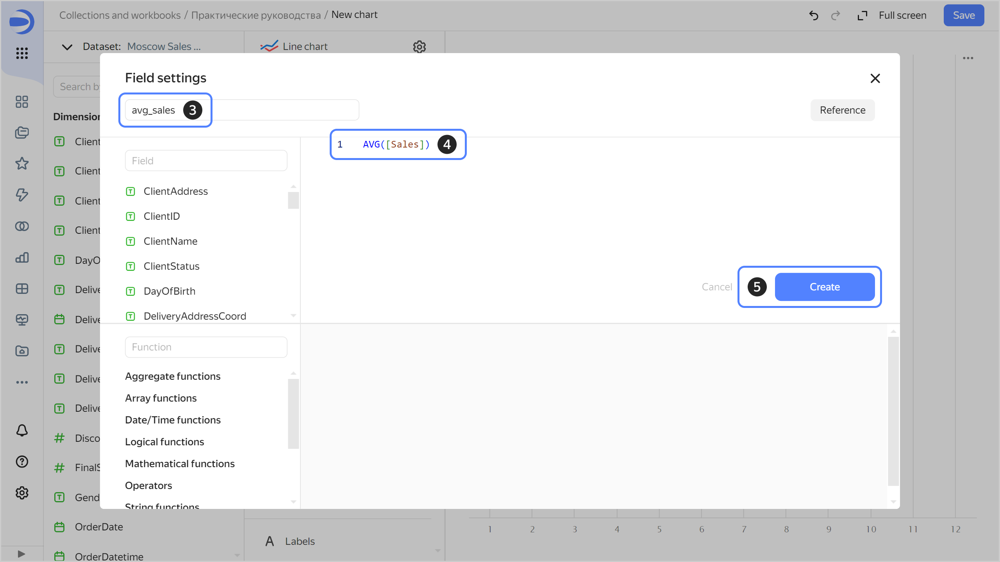

# Calculated fields

A calculated field is an additional [data field](../../dataset/index.md#field) with values calculated using a formula.
You can use calculated fields to create new dimensions and measures. The data source remains unchanged.

To write formulas, you can use the existing dataset fields, [parameters](../parameters.md), constants, and [functions](#functions).

You can [create](#how-to-create-calculated-field) calculated fields in the dataset or wizard interface:

* Calculated fields from a dataset are available in all charts above this dataset.
* Calculated fields from the wizard are only available for saved charts.

Calculated fields are marked with .

## Calculated fields in datasets {#dataset}

You can add new fields to a dataset field list.

When creating a formula, you can use any dataset field, including the calculated fields you previously created. In a formula, you can also use parameters created at the dataset level.

After creating a calculated field and saving the dataset, the field becomes available to all charts and dashboard [selectors](../../dashboard/selector.md) based on that dataset.

To hide fields in the wizard, enable the **Do not display in wizard** option when creating them.

## Calculated fields in charts {#chart}

You can add new fields when creating and editing charts in the wizard:

* In the list of fields from a dataset.
* In the visualization section.

When creating a formula, you can use any dataset field, including the calculated fields you previously created. In a formula, you can also use the parameters of the chart or dataset based on which the chart is created.

If a field is created in a chart, it will not be available to dashboard selectors and other charts.



In [multi-dataset charts](../chart/index.md#multi-dataset-charts), calculated fields are not applicable to fields from multiple datasets.



## Functions {#functions}

Functions are the principal components used for creating formulas. You can use them to perform various operations on data fields.

The list of available functions depends on the data source. For more information, see [{#T}](../../function-ref/availability.md).



Avoid calculation loops: in a formula, you cannot use a field that uses the same formula to calculate its own value.



### Notation format {#entry-format}

Write formulas according to the following requirements:

1. Specify function arguments in parentheses, e.g., `YEAR([DATE1])`. Separate multiple arguments with commas.
1. Specify field names in square brackets, e.g., `[CustomerID]`.
1. Make sure to enter the values of fields and constants in a valid [format](../../dataset/data-types.md). For example, use a period as a decimal separator: `0.123`.



* Field name syntax is case-sensitive. For example, if the formula uses `[NAME]`, while the dataset contains only `[Name]`, the formula field will be highlighted in red.
* Function syntax is not case-sensitive. For example, `count` and `COUNT` will perform the same operation.



For more information on format, types of accepted arguments, and returned function values, use the **Reference** button when adding a field in the formula editor interface.

## How to create a calculated field {#how-to-create-calculated-field}

You can create calculated fields in the dataset or wizard interface.



- Datasets

  

  

- Wizard

  

  1. In the left-hand panel, click  **Charts** and select the chart created in the [wizard]({{ link-datalens-wizard }}).
  1. On the left side of the screen above the list of dataset fields, click  and select **Field**.
  1. Enter a name for the field.
  1. Enter the required formula.
  1. Click **Create**. The field will appear in the list on the left. You can use it in a chart.

  



#### See also {#see-also}

* [{#T}](../../dataset/create-dataset.md#create-fields)
* [{#T}](../../security/row-level-security.md)
