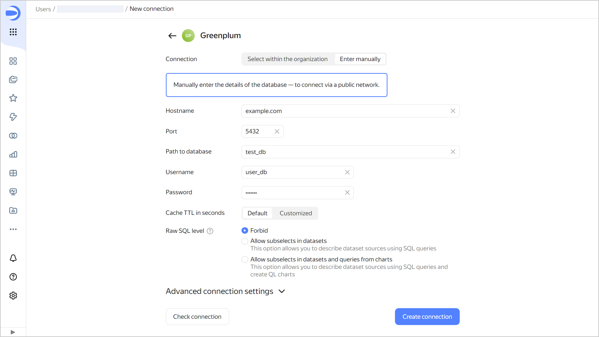

# Creating a {{ GP }} connection







To create a {{ GP }} connection:

1. Open the page for [creating a new connection]({{ link-datalens-main }}/connections/new).
1. Under **Databases**, select the **Greenplum** connection.

1. Select the connection type:

   

   - Select in organization {#organization}

     

     * **Cloud and folder**: Select the folder where the cluster is located.
     * **Cluster**: Specify a cluster from the list of available {{ GP }} clusters. Cluster settings must have the **{{ datalens-short-name }}** access option enabled. If you do not have an available cluster, click **Create new**.

       

     * **Host type**. Select a host type:
       
       * **Regular** (default): Allows you to select regular hosts to connect to.
       * **Special FQDNs**: Allows you to select a [special FQDN](../../../managed-greenplum/operations/connect.md#fqdn-master) for connection, which always points to the primary {{ GP }} master host.

     * **Hostname**: Select the host name from the list of hosts available in the {{ GP }} cluster. You can select multiple hosts. If you are unable to connect to the first host, {{ datalens-short-name }} will select the next one from the list.
     * **Port**: Specify the {{ GP }} connection port. The default port is {{ port-mgp }}.
     * **Path to database**: Specify the name of the database to connect to.
     * **Username**: Specify the username for the {{ GP }} connection.
     * **Password**: Enter the password for the user.
     * **Cache TTL in seconds**: Specify the cache time-to-live or leave the default value. The recommended value is 300 seconds (5 minutes).
     * **Raw SQL level**: Enables you to use an ad-hoc SQL query to [generate a dataset](../../dataset/settings.md#sql-request-in-datatset).

   - Specify manually {#manual}

     

      * **Hostname**: Specify the path to a master host or a {{ GP }} master host IP address. You can specify multiple hosts in a comma-separated list. If you are unable to connect to the first host, {{ datalens-short-name }} will select the next one from the list.
      * **Port**: Specify the {{ GP }} connection port. The default port is 5432.
      * **Path to database**: Specify the name of the database to connect to.
      * **Username**: Specify the username for the {{ GP }} connection.
      * **Password**: Enter the password for the user.
      * **Cache TTL in seconds**: Specify the cache time-to-live or leave the default value. The recommended value is 300 seconds (5 minutes).
      * **Raw SQL level**: Enables you to use an ad-hoc SQL query to [generate a dataset](../../dataset/settings.md#sql-request-in-datatset).

      

   

1. (Optional) Test the connection. To do this, click **Check connection**.
1. Click **Create connection**.

1. Select a [workbook](../../workbooks-collections/index.md) to save your connection to or create a new one. If using legacy folder navigation, select a folder to save the connection to. Click **Create**.

1. Enter a name for the connection and click **Create**.

## Additional settings {#additional-settings}


